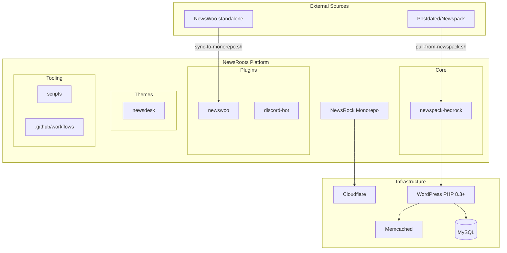
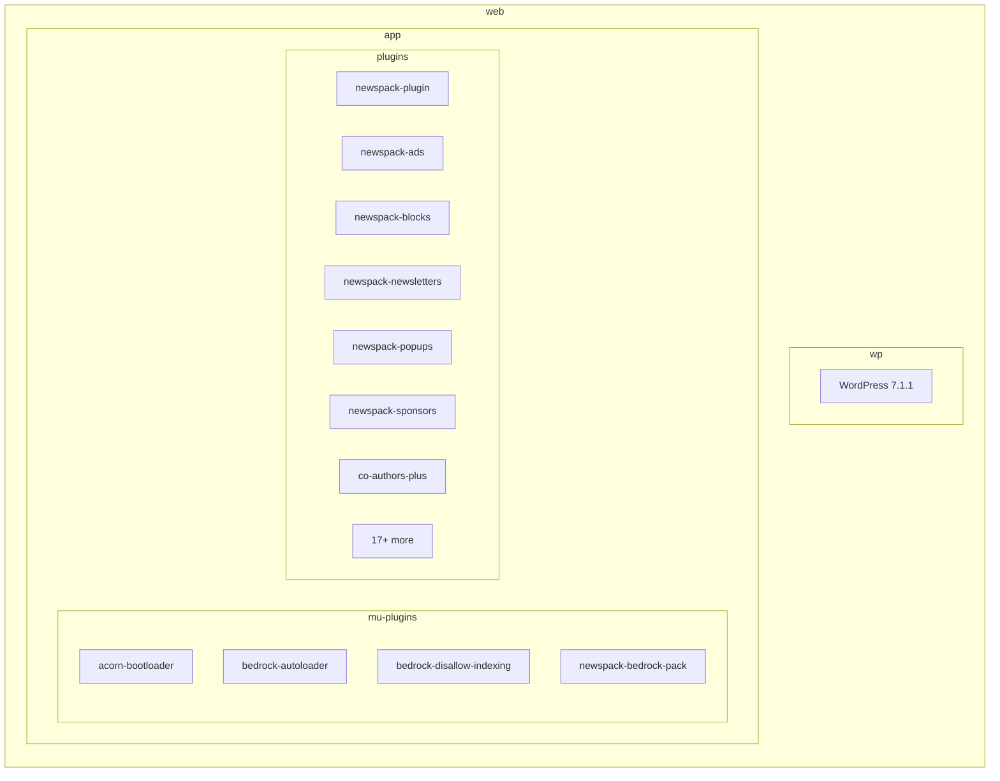
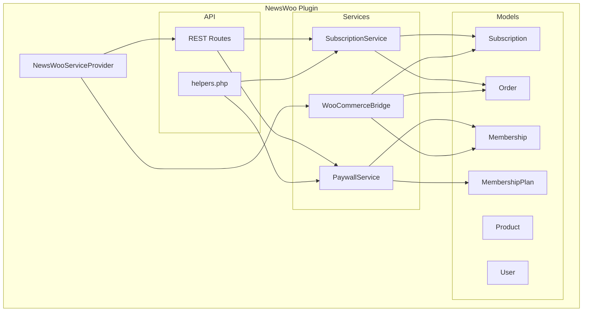
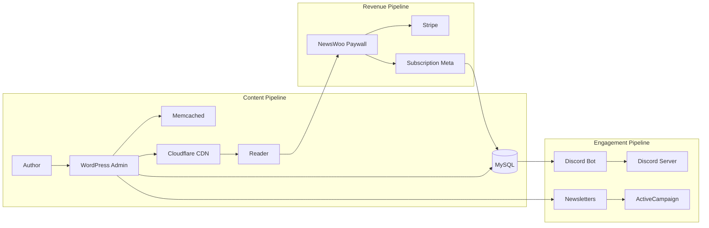
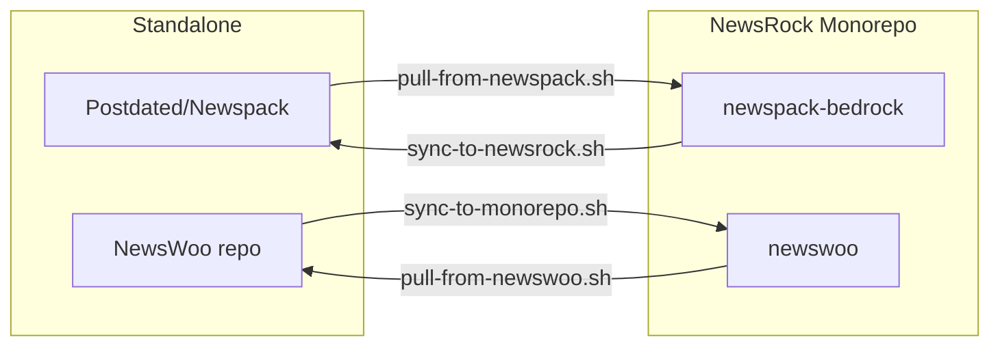

# NewsRoots -- Core Platform Planning

> **Self-Improving Loop Template**: see /Users/penelope/Documents/tir/self-improving-loop-template.md
> **Last updated**: 2026-09-20
> **Status**: Planning
> **Workspace**: /Users/penelope/Documents/ChatGPT/Bedrock

---

## Mission Card

| Field | Value |
|-------|-------|
| **Task Name** | NewsRoots Core Platform |
| **Prompt Version** | v1.0 |
| **Success Looks Like** | Fully documented, diagrammed, deployable NewsRoots monorepo with core Bedrock platform, NewsWoo plugin, NewsDesk theme, and CI/CD published to a GitHub org with working workflows |
| **Failure Looks Like** | Undocumented code, missing diagrams, orphaned repos, broken sync scripts, no clear deployment path |
| **Stop Condition** | All tasks below marked done, second-model verification complete, remote tree verified |

---

## Architecture

### High-Level System

### Core Bedrock Stack

### NewsWoo Plugin Architecture

### Data Flow

### Sync Architecture

---

## Plugin Ecosystem

| Category | Packages | Source |
|----------|----------|--------|
| **Newspack Core** | newspack-plugin, newspack-blocks, newspack-ads, newspack-newsletters, newspack-popups, newspack-sponsors, newspack-elections, newspack-cache-cozy, newspack-rolling-coverage, newspack-story-budget, newspack-revisions-enhanced, newspack-multibranded-site, newspack-post-image-downloader | automattic/* via wp-packages |
| **Postdated Custom** | newspack-bedrock-pack, newspack-local-esps, newsroom-image-downloader, newsroom-speed-cache, newpack-discord-bot-api | postdated/* via path repo |
| **WordPress** | co-authors-plus, fifu-premium, flux-media-optimizer, slim-seo, onesignal, bwps, ai | wp-plugin/* |
| **Framework** | roots/acorn, roots/bedrock-*, roots/wordpress, livewire | roots/* |
| **Dev** | pest, pint, roave/security-advisories | dev-only |

---

## Current State Assessment

### What Exists

| Component | Location | Status | Notes |
|-----------|----------|--------|-------|
| NewsRock monorepo | NewsRock/ | Local OK, Remote unknown | Contains newspack-bedrock, newswoo, newsdesk, scripts |
| newspack-bedrock | NewsRock/newspack-bedrock/ | v1.1.0, 30+ plugins | Composer installable, tests present |
| newswoo | NewsRock/newswoo/ | Code written, Phase 2 stripping pending | 6 Eloquent models, 3 services, REST API, mu-plugin, config, smoke tests |
| newswoo source | NewsWoo/ | WooCommerce zips present | 11.1.1 core + Subscriptions 9.2.0 + Memberships 1.30.0 |
| newsdesk | NewsRock/newsdesk/ | Placeholder only | Just a README |
| discord-bot | Newspack/discord-bot/ | Docker setup | Dockerfile, docker-compose, .env.example |
| Sync scripts | NewsRock/scripts/ | Written, Untested | pull-from-newspack, pull-from-newswoo, sync-to-monorepo |
| CI workflows | NewsRock/.github/workflows/ | Written | ci.yml, sync-newspack.yml |
| Compliance audit | NewsRock/newswoo/FULL_COMPLIANCE_AUDIT.md | Done | 23 items checked, 8 pass, 11 fail |

### Key Issues

1. **GitHub access**: Need to verify gh auth and determine target org
2. **Remote state**: No remote configured for this workspace
3. **newswoo Phase 2**: Core stripping not started (shipping, inventory, cart, coupons, tax)
4. **newsdesk**: Empty -- needs Sage/Bedrock theme scaffold
5. **No deployment path**: No Cloudflare Workers, no hosting config
6. **No diagrams in repo**: AGENTS.md requires pipeline diagrams

---

## Task List

### Phase 1: Foundation

- [ ] **1.1** Verify GitHub auth and accessible orgs
- [ ] **1.2** Determine target org (Postdated vs tir-labs vs new)
- [ ] **1.3** Initialize git in Bedrock workspace and set remote
- [ ] **1.4** Push current monorepo to remote
- [ ] **1.5** Verify remote tree matches local (API/tree check)
- [ ] **1.6** Add architecture diagrams to repo README

### Phase 2: Core Hardening

- [ ] **2.1** Run composer install in newspack-bedrock and verify
- [ ] **2.2** Run existing tests (pest) and fix failures
- [ ] **2.3** Verify all symlinked plugins resolve correctly
- [ ] **2.4** Test Memcached object-cache.php integration
- [ ] **2.5** Document .env configuration requirements
- [ ] **2.6** Create local dev setup script

### Phase 3: NewsWoo Core Stripping

- [ ] **3A** Strip shipping (12 files, zone/class tables, checkout fields)
- [ ] **3B** Strip inventory (108 files, stock management, low-stock emails)
- [ ] **3C** Simplify cart (96 files, direct checkout, remove cart page)
- [ ] **3D** Simplify coupons (66 files, keep basic % and fixed only)
- [ ] **3E** Simplify tax (geo-location removal, billing-only)
- [ ] **3F** Wire payment gateways (Stripe, Apple Pay)
- [ ] **3G** Write NewsWoo integration tests
- [ ] **3H** Sync to monorepo

### Phase 4: NewsDesk Theme

- [ ] **4.1** Scaffold Sage/Bedrock theme
- [ ] **4.2** Implement base layout
- [ ] **4.3** Implement paywall UI components
- [ ] **4.4** Style for newsroom use case
- [ ] **4.5** Test with newspack-blocks

### Phase 5: Deployment

- [ ] **5.1** Choose hosting (Cloudflare Pages/Workers vs traditional)
- [ ] **5.2** Create Cloudflare Worker for edge routing
- [ ] **5.3** Set up DNS
- [ ] **5.4** Configure CI/CD pipeline
- [ ] **5.5** Deploy staging
- [ ] **5.6** Health check and smoke test

### Phase 6: Documentation

- [ ] **6.1** Update all READMEs
- [ ] **6.2** Add Mermaid diagrams to every product README
- [ ] **6.3** Document sync workflow
- [ ] **6.4** Create onboarding guide
- [ ] **6.5** License audit (GPL-2.0)

---

## Decisions Log

| Date | Decision | Rationale |
|------|----------|-----------|
| 2026-09-20 | Use NewsRock as monorepo reference | User specified structure it like NewsRock |
| 2026-09-20 | Bedrock + Acorn stack | Roots ecosystem for modern WordPress |
| 2026-09-20 | Memcached over Redis | Roots Trellis default, simpler ops |
| 2026-09-20 | PHP 8.3+ minimum | Modern WordPress + Acorn requirement |
| 2026-09-20 | Composer-first plugin management | No manual plugin installs |
| 2026-09-20 | Eloquent models for NewsWoo | Clean API over raw WC data stores |
| 2026-09-20 | WooCommerceBridge pattern | Keep WC hooks compatible while using Eloquent |

---

## NewsWoo Compliance Summary

From FULL_COMPLIANCE_AUDIT.md (23 items):

| Status | Count | Key Items |
|--------|-------|-----------|
| PASS | 8 | Security, structure, documentation |
| PARTIAL | 2 | Composer, service provider |
| FAIL | 11 | Code quality, patterns, compatibility (WC legacy code) |

The 6 new Eloquent models (Subscription, Membership, MembershipPlan, Order, Product, User) and 3 services (SubscriptionService, PaywallService, WooCommerceBridge) are fully Roots-compliant. The FAIL items are in the upstream WooCommerce source that Phase 3 stripping will address.

---

## Notes

- NEWSPACK_LOCAL_MODE = true in config (local-first development)
- DISALLOW_FILE_EDIT and DISALLOW_FILE_MODS both true (Composer-only changes)
- Plugins symlinked from packages/ via Composer installer-paths
- newspack-bedrock-pack mu-plugin is the loader for all local packages
- NewsWoo has REST API routes at /newspack-woo/v1/ for MRR, churn, access checks, user summary

---

*Next action: Verify GitHub auth (Task 1.1)*

